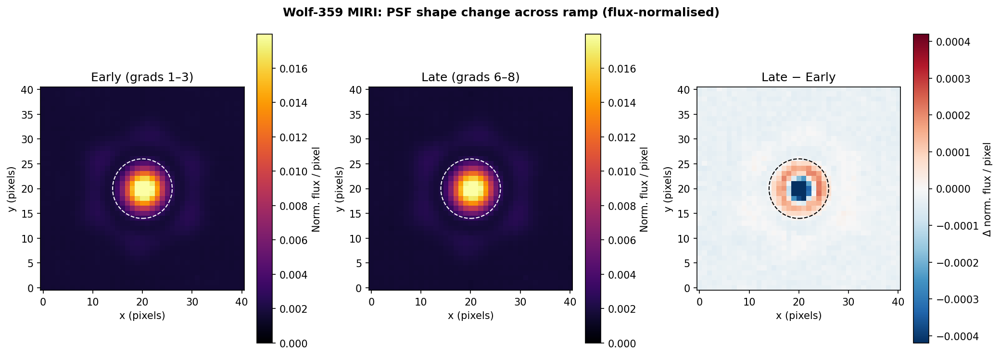
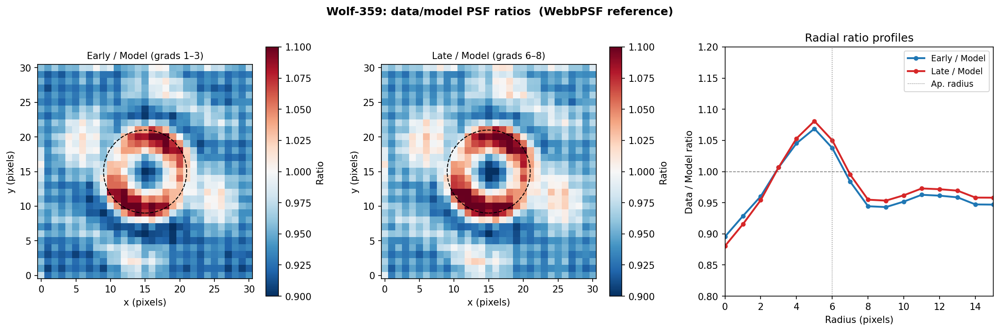
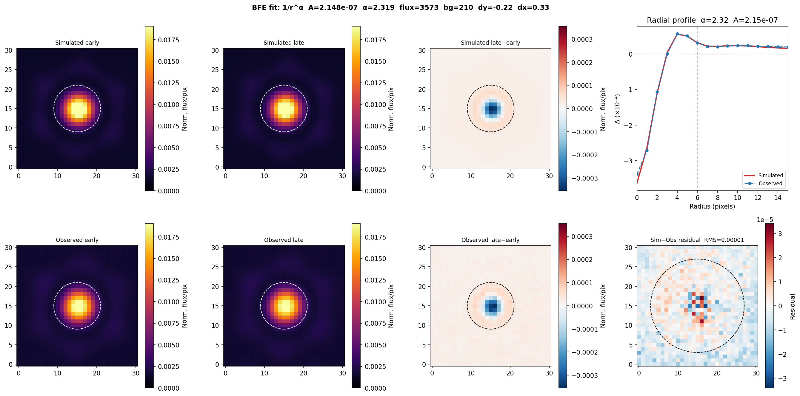
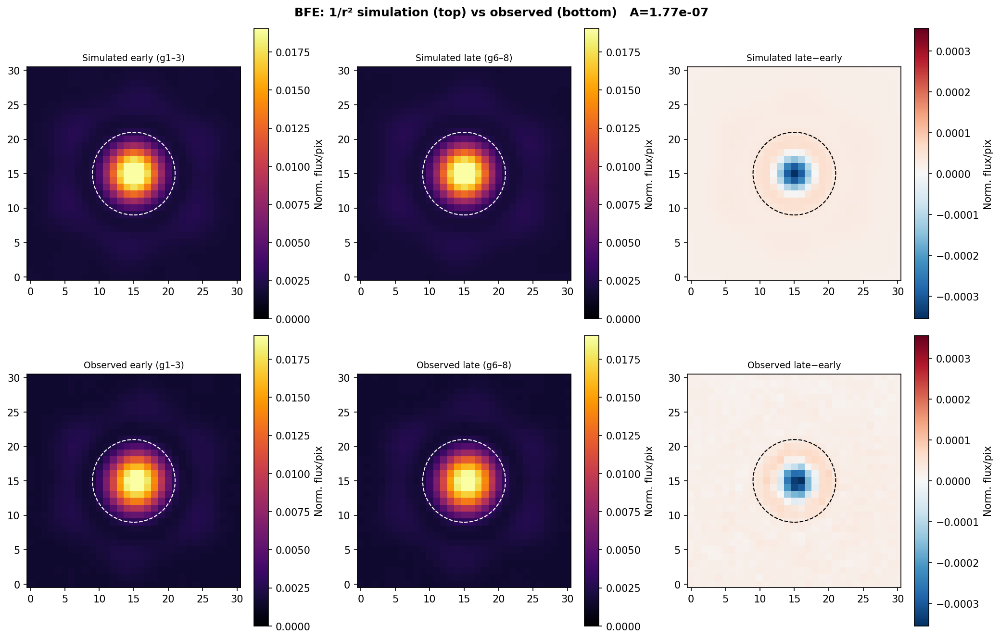

# Brighter-Fatter Effect: Physics-Based Forward Model

## Overview

After correcting for charge reset decay in MIRI ramp data, a residual
systematic remains: bright pixels show a declining gradient profile across
the ramp, while faint pixels are flat. The gradient (DN/group) should be
constant for a constant source, so the decline is instrumental. This document
describes the physical mechanism and the forward model developed to characterise it.

---

## Physical Mechanism

As charge accumulates in a pixel during an integration, the electric field
inside the pixel grows. In a 2D detector, charge confined in the pixel plane
creates a repulsive force on newly arriving photoelectrons. This electrostatic
repulsion causes the effective collection area of a bright pixel to shrink,
redistributing electrons to neighbouring pixels. The result is:

- PSF core dims progressively through the ramp (charge in core repels new
  electrons)
- A ring around the core brightens correspondingly

This is the **brighter-fatter effect (BFE)**, well documented in optical CCDs
and HgCdTe infrared arrays, including HST/WFC3-IR and JWST NIRCam.

### Electrostatics in 2D

For a pixel treated as a charge sheet, the electric force on a test charge at
position **r** from the pixel centre follows:

$$E \propto \frac{1}{r}$$

(Gauss's law in 2D: the field from a line charge falls off as 1/r, not 1/r²
as in 3D). The force on the accumulated charge from all other pixels, and the
resulting electron displacement, therefore scales as a kernel:

$$K(i,j) \propto -\frac{1}{r^\alpha}, \quad r = \sqrt{i^2 + j^2} > 0$$

The exponent α ≈ 1 for pure 2D electrostatics but is a free parameter that
absorbs the effective dimensionality of charge spreading, pixel geometry, and
any diffusion contributions.

### Flux Conservation

The BFE redistributes electrons — it does not create or destroy them. The
kernel must be flux-conserving:

$$\sum_{i,j} K(i,j) = 0$$

This is enforced by setting the central pixel value to:

$$K(0,0) = -\sum_{(i,j)\neq(0,0)} K(i,j) > 0$$

The positive centre means accumulated charge in a pixel drives electrons
*out* of that pixel; the negative off-diagonal elements receive the displaced
electrons from surrounding bright pixels.

---

## Observed BFE Signature in Wolf-359 Data

The BFE signature is directly visible by comparing flux-normalised gradient
images at early groups (low accumulated charge) versus late groups (high
accumulated charge).



**Figure 1.** Median gradient image at early groups (g1–3, left), late groups
(g6–8, centre), and the difference late − early (right), all normalised to the
same aperture flux. The difference image shows the BFE signature: a negative
core (electrons lost from the PSF centre) and a positive ring (electrons
gained by the surrounding pixels).

The effect is also visible in the ratio of each group-averaged PSF to the
WebbPSF reference model:



**Figure 2.** Ratio of early-group (top) and late-group (bottom) PSF images
to the WebbPSF F2100W model, with radial profiles. The early/model ratio is
close to unity. The late/model ratio shows a deficit at r < 3 px and an
excess at r ≈ 4–8 px, consistent with BFE-driven charge redistribution.

---

## WebbPSF Reference PSF

The MIRI F2100W point spread function model was generated using WebbPSF
(STScI):

```python
import webbpsf
miri = webbpsf.MIRI()
miri.filter = 'F2100W'
psf = miri.calc_psf(oversample=4, fov_pixels=65)
```

The PSF was computed at 4× oversampling (0.02773 arcsec/pixel) and rebinned
to the native detector scale (0.111 arcsec/pixel):

```python
psf_over = psf['OVERSAMP'].data
ny_o = psf_over.shape[0]
ny = ny_o // 4
psf_nat = psf_over.reshape(ny, 4, ny, 4).sum(axis=(1, 3))
```

The model PSF was registered to the data by fitting position (dy, dx), flux
scale, and background via Nelder-Mead minimisation of sum-of-squared residuals
against the early-group cutout image.

---

## Forward Model

For a pixel at position (x, y), the measured gradient at group g is:

$$\text{grad}(x, y; g) = \text{rate}(x,y) \times \left[1 - A \cdot (K \ast Q)(x,y;g)\right]$$

where:
- **rate(x, y)** — true photon rate (DN/group), approximated by the registered
  WebbPSF scaled to the observed late-group flux
- **A** — dimensionless BFE coupling coefficient (DN⁻¹)
- **K** — the physics-driven BFE kernel (flux-conserving, 1/r^α off-diagonal)
- **Q(x, y; g)** — accumulated charge at pixel (x, y) up to group g,
  approximated as `rate(x, y) × g`
- **⊛** — 2D convolution

The kernel has a half-width of 20 pixels:

```python
kh = 20
ii, jj = np.mgrid[-kh:kh+1, -kh:kh+1].astype(float)
r_grid = np.sqrt(ii**2 + jj**2)
K_bfe = np.where(r_grid > 0, -1.0 / r_grid**alpha, 0.0)
K_bfe[kh, kh] = -K_bfe.sum()   # flux conservation
```

The simulation iterates over groups:

```python
for g in range(n_groups):
    Q_g = rate_map * g
    KQ = fftconvolve(Q_g, K_bfe, mode='same')
    grads_sim[g] = rate_map * (1.0 - A * KQ)
```

---

## Parameter Fitting

The model has six free parameters: `[log₁₀A, α, flux, bg, dy, dx]`.

The objective function is the sum of squared pixel residuals between the
simulated and observed flux-normalised late − early PSF difference image,
evaluated within a circular aperture of radius 12 pixels:

```python
def objective(params):
    log_A, alpha, flux, bg, dy, dx = params
    A = 10**log_A
    early_sim, late_sim = run_sim(A, alpha, flux, bg, dy, dx)
    diff_sim = (late_sim - early_sim) / aperture_flux(late_sim)
    return np.sum((diff_sim[fit_mask] - obs_diff[fit_mask])**2)
```

Optimisation used differential evolution (global search) followed by
Nelder-Mead (local polish):

```python
bounds = [(-9, -5), (0.5, 4.0), (1000, 4000), (0, 400), (-2, 2), (-2, 2)]
res = differential_evolution(objective, bounds, seed=42, maxiter=2000)
res2 = minimize(objective, res.x, method='Nelder-Mead',
                options={'xatol': 1e-10, 'fatol': 1e-14, 'maxiter': 50000})
```

Freeing the source position (dy, dx) reduced the residual by a factor of ~4
compared to fixing the position from the early-group registration.

### Best-fit Parameters

| Parameter | Value |
|-----------|-------|
| A (coupling) | 2.148 × 10⁻⁷ DN⁻¹ |
| α (power law) | 2.319 |
| Flux scale | 3573 DN/group |
| Background | 210 DN/group |
| dy | −0.220 px |
| dx | 0.327 px |
| Final residual | 1.89 × 10⁻⁸ |

---

## Model vs Data Comparison



**Figure 3.** Comparison of simulated and observed PSF change due to the BFE.
**Top row (simulated):** early-group PSF, late-group PSF, simulated
late − early difference, and radial profile comparison.
**Bottom row (observed):** same quantities from the Wolf-359 data.
**Bottom-right:** residual between simulated and observed difference images.
The model reproduces the negative core and positive ring at the correct
amplitude and spatial scale.

---

## Simulation Intermediate Steps



**Figure 4.** Forward simulation showing the progressive PSF distortion as
charge accumulates. Each panel shows the BFE-modified gradient image at a
given group, normalised to the aperture flux. The core-dimming and ring-
brightening grow monotonically with accumulated charge Q(g).

---

## Status and Limitations

The forward model successfully reproduces the observed PSF shape change
with physically motivated parameters. However, applying the inversion:

$$\text{grad}_\text{cor}(x,y;g) = \frac{\text{grad}_\text{obs}(x,y;g)}{1 - A \cdot (K \ast Q)(x,y;g)}$$

does not flatten the gradient profiles in practice. The fitted A is derived
from PSF morphology (spatial redistribution of flux between pixels), not from
the profile slope (temporal evolution of flux within a single pixel's
aperture-summed light curve). These are related but not identical quantities,
and the correction formula diverges when A is increased to levels that would
flatten the aperture-integrated profiles.

A complete correction likely requires either:
1. Fitting A directly to the flatness of aperture-summed gradient profiles
   in a regime where the denominator remains stable, or
2. An iterative correction scheme that avoids the divergence near bright pixels.
